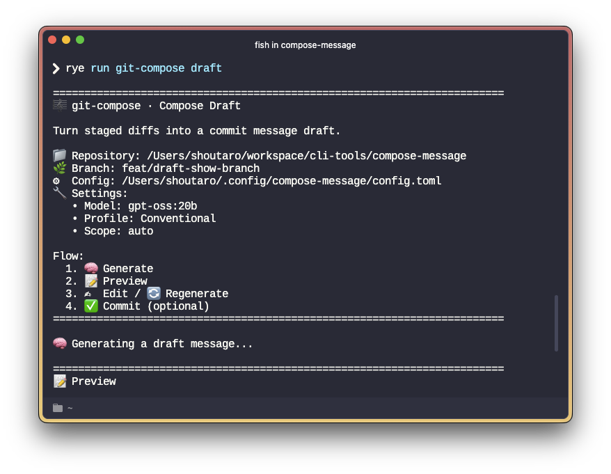

# 🎼 git-compose — Compose Better Commit Messages

[](https://github.com/shou-taro/compose-message/actions)
[](https://pypi.org/project/compose-message/)
[](./LICENSE)
[](https://github.com/astral-sh/ruff)
[](#)
[](https://ollama.com)
[](#)

📘 English version: [README.md](README.md)

ステージ済み差分から、**構造化されたコミットメッセージの下書き** を生成する CLI ツールです。



## ❓ Why

- コミットメッセージは履歴として長く残るため、読みやすさと一貫性が重要です。
- Conventional Commits は件名を標準化しますが、本文の書き方は定義されていません。
- git-compose は本文構造を固定することで、内容に集中できる環境を提供します。


## ✨ 特徴

- 🧠 ステージ済み差分からコミットメッセージを生成
- 👀 プレビュー → 編集 → 再生成の対話的フロー
- 📜 Conventional Commits 対応 (任意)
- 📐 本文構造を標準化し、書き方のブレを防止
- 🔒 Ollama を利用したローカル LLM 実行 (外部 API 不要)
- 🔌 今後 OpenAI / Gemini / Claude など複数の LLM プロバイダに対応予定


## 🚀 クイックスタート

### インストール

> ⚠️ PyPI への公開は近日予定です。  
> 現在はリポジトリからインストールしてください。

```bash
git clone https://github.com/shou-taro/compose-message.git
cd compose-message
pip install -e .
```

### 初期設定

```bash
git compose init
```

対話形式で以下を設定します：

- 言語（ja / en）
- 使用する Ollama モデル
- Conventional Commits の使用有無
- 使用するエディタ など

設定はデフォルトで **グローバル** に保存されます。

リポジトリ単位で設定する場合：

```bash
git compose init --local
```

### コミットメッセージの下書きを生成

```bash
git add .
git compose draft
```


## 🧩 draft コマンドの流れ

```
1. 🧠 Generate
2. 👀 Preview
3. 📝 Edit / 🔁 Regenerate
4. ✅ Commit (optional)
```

コミットは **必須ではありません**。
生成された下書きを確認し、納得した場合のみコミットできます。


## 📝 出力されるコミットメッセージ形式

### Conventional Commits 有効時

```text
✨ feat(draft): プレビュー付きでメッセージ生成

変更内容:
- ステージ済み差分からメッセージを生成
- プレビューを表示
- 再生成をサポート
```

### Conventional Commits 無効時

```text
✨ プレビュー付きでメッセージ生成

変更内容:
- ステージ済み差分からメッセージを生成
- プレビューを表示
- 再生成をサポート
```

### ポイント

- 件名 → 空行 → 本文、という Git 標準構造
- 本文は必ず箇条書き（最低 1 つ以上）
- Markdown ではなくプレーンテキスト


## 🧠 設計思想

- git-compose は **自動コミットしません**
- 最終判断は常にユーザーに委ねます
- 生成結果は「下書き」であり、編集前提です


## 🚫 非目標 (Non-goals)

git-compose は以下を目的としていません：

- 自動リリースやバージョン管理
- CI/CD との統合
- プロジェクト管理ツール化


## 📦 現在の制限 (v0.1)

- 現在対応している LLM プロバイダは Ollama のみ（将来的に拡張予定）
- コミットメッセージテンプレートの外部ファイル化は未対応
- pytest による単体テストは今後追加予定


## 📄 ライセンス

MIT License